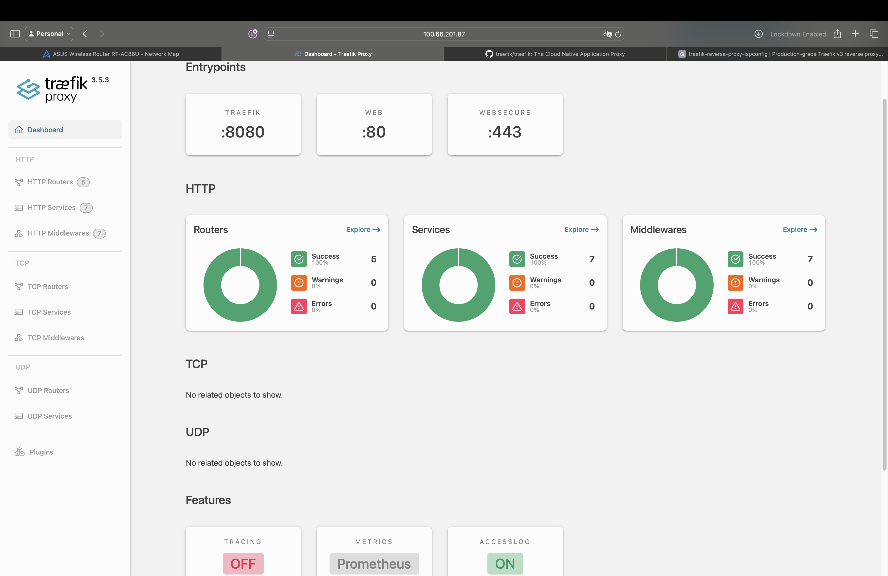
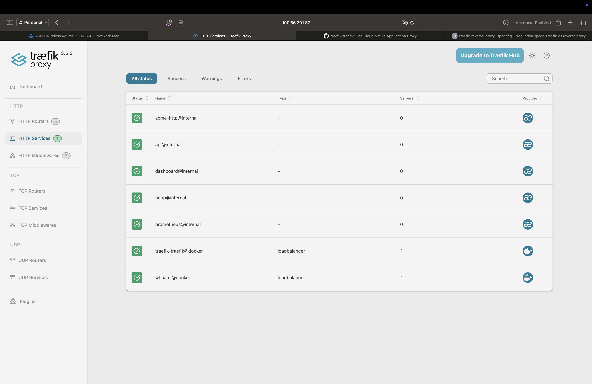
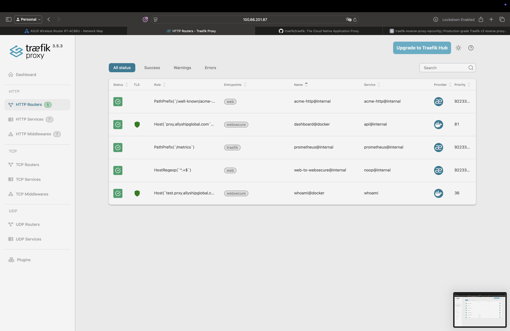

<div align="center">

# 🚀 Traefik Reverse Proxy on ISPConfig

**Production-grade Traefik v3 deployment for ISPConfig VPS with zero downtime**

[](https://traefik.io/)
[](https://www.docker.com/)
[](https://www.ispconfig.org/)
[](https://letsencrypt.org/)



</div>

---

## 📋 Table of Contents

- [Overview](#-overview)
- [Features](#-features)
- [Architecture](#-architecture)
- [Prerequisites](#-prerequisites)
- [Installation](#-installation)
- [Configuration](#-configuration)
- [Plugins](#-plugins)
- [Usage](#-usage)
- [Monitoring](#-monitoring)
- [Troubleshooting](#-troubleshooting)
- [Security](#-security)
- [Contributing](#-contributing)
- [License](#-license)

---

## 🎯 Overview

This project provides a **production-ready Traefik v3 reverse proxy** deployment on an ISPConfig VPS, specifically designed to coexist with existing ISPConfig services without conflicts. Perfect for hosting multiple Docker applications with automatic SSL/TLS certificates, advanced routing, and enterprise-grade security features.

### Why This Solution?

- ✅ **Zero Downtime**: Deployed on alternative ports (8082/8443) to avoid ISPConfig conflicts
- ✅ **Automatic SSL**: Let's Encrypt integration with HTTP challenge
- ✅ **Production Security**: BasicAuth, fail2ban, rate limiting, security headers
- ✅ **Easy Management**: Docker Compose-based deployment
- ✅ **Plugin System**: Fail2Ban, OIDC authentication, GeoBlocking support
- ✅ **Monitoring Ready**: Prometheus metrics built-in

---

## ✨ Features

### Core Features

- 🔐 **Automatic HTTPS** with Let's Encrypt
- 🐳 **Docker Integration** - Auto-discover containers
- 📊 **Prometheus Metrics** - Built-in monitoring
- 🛡️ **Security Headers** - HSTS, CSP, XSS protection
- 🚦 **Rate Limiting** - DDoS protection
- 📝 **Access Logs** - JSON formatted logging
- 🎨 **Modern Dashboard** - Real-time monitoring UI

### Advanced Plugins

- 🚫 **Fail2Ban** - Automated IP banning for brute force protection
- 🔑 **OIDC Authentication** - Enterprise SSO integration (Google, Azure AD, Keycloak)
- 🌍 **GeoBlocking** - Country-based access control
- 🔒 **BasicAuth** - Simple authentication layer

---

## 🏗️ Architecture

### Port Configuration

| Service | Port | Purpose |
|---------|------|---------|
| **ISPConfig Apache** | 80, 443 | Web hosting (unchanged) |
| **ISPConfig Admin** | 8080 | Control panel (unchanged) |
| **ISPConfig Webmail** | 8081 | Email interface (unchanged) |
| **Traefik HTTP** | 8082 | Container HTTP (redirects to HTTPS) |
| **Traefik HTTPS** | 8443 | Container HTTPS |
| **Traefik Dashboard** | 8084 | Management UI |

### Network Topology

```
Internet
   ↓
Firewall (iptables)
   ├─→ Ports 80/443 → Apache/ISPConfig (existing websites)
   ├─→ Port 8080 → ISPConfig Admin Panel
   ├─→ Port 8081 → Webmail
   └─→ Ports 8082/8443/8084 → Traefik (Docker containers)
              ↓
        traefik-public network
              ↓
        Docker Containers (auto-discovered)
```

---

## 📦 Prerequisites

- **OS**: Ubuntu 24.04 LTS (ARM64 or x86_64)
- **ISPConfig**: 3.x installed and running
- **Docker**: 20.10+ (automatically installed during setup)
- **RAM**: Minimum 4GB (8GB+ recommended)
- **Disk**: 10GB+ free space
- **Network**: Public IP with DNS access

---

## 🚀 Installation

### Quick Start

```bash
# Clone this repository
git clone <your-repo-url>
cd traefik

# Deploy to production directory
sudo mkdir -p /opt/traefik/{config/dynamic,logs,acme}
sudo cp traefik.yml /opt/traefik/config/
sudo cp docker-compose.yml /opt/traefik/
sudo cp -r dynamic/* /opt/traefik/config/dynamic/

# Set permissions
sudo chmod 600 /opt/traefik/acme/acme.json
sudo chmod -R 755 /opt/traefik

# Start Traefik
cd /opt/traefik
sudo docker compose up -d
```

### Detailed Installation

For step-by-step instructions with safety checks, see [DEPLOYMENT_COMPLETE.md](./DEPLOYMENT_COMPLETE.md).

---

## ⚙️ Configuration

### Traefik Static Configuration

Located at `/opt/traefik/config/traefik.yml`:

```yaml
# Entry Points
entryPoints:
  web:
    address: ":80"
  websecure:
    address: ":443"

# Docker Provider
providers:
  docker:
    exposedByDefault: false
    network: traefik-public
```

### Dynamic Configuration

Located at `/opt/traefik/config/dynamic/`:

- `security-headers.yml` - HTTP security headers
- `fail2ban-config.yml` - Fail2ban plugin settings
- `geoblock-config.yml` - Geographic restrictions

### Environment Variables

Edit `docker-compose.yml` to customize:

```yaml
environment:
  - TZ=Etc/UTC  # Change to your timezone
```

---

## 🔌 Plugins

### Installed Plugins

#### 1. **Fail2Ban** (v0.8.7)
Automatic IP banning after failed authentication attempts.

```yaml
http:
  middlewares:
    fail2ban:
      plugin:
        fail2ban:
          rules:
            bantime: "3h"
            maxretry: "4"
```

[Full Documentation →](https://plugins.traefik.io/plugins/628c9ebcffc0cd18356a979f/fail2-ban)

#### 2. **Traefik OIDC** (v0.7.8)
Enterprise Single Sign-On with OAuth2/OIDC providers.

**Supported Providers:**
- Google Workspace
- Microsoft Azure AD
- Keycloak
- Auth0
- Okta

[Full Documentation →](https://plugins.traefik.io/plugins/6613338ea28c508f411a44d5/traefik-oidc)

#### 3. **GeoBlock** (v0.3.3)
Restrict access based on visitor's country.

```yaml
countries:
  - "US"
  - "CA"
  - "GB"
```

[Full Documentation →](https://plugins.traefik.io/plugins/65c37fd5e4c5c70685de8f7c/geoblock)

---

## 📖 Usage

### Adding a New Application

Create a `docker-compose.yml` for your app:

```yaml
version: '3.8'

services:
  myapp:
    image: your-app:latest
    networks:
      - traefik-public
    labels:
      - "traefik.enable=true"
      - "traefik.http.routers.myapp.rule=Host(`myapp.prxy.allyshipglobal.com`)"
      - "traefik.http.routers.myapp.entrypoints=websecure"
      - "traefik.http.routers.myapp.tls.certresolver=letsencrypt"
      - "traefik.http.services.myapp.loadbalancer.server.port=80"
      
      # Optional: Add security
      - "traefik.http.routers.myapp.middlewares=security-headers@file,fail2ban@file"

networks:
  traefik-public:
    external: true
```

### Accessing the Dashboard

**URL**: `https://prxy.allyshipglobal.com:8443/dashboard/`  
**Credentials**:
- Username: `Admin`
- Password: (configured during setup)

### Common Commands

```bash
# View logs
sudo docker logs -f traefik

# Restart Traefik
cd /opt/traefik
sudo docker compose restart

# Stop Traefik
sudo docker compose down

# View container status
sudo docker ps
```

---

## 📊 Monitoring

### Prometheus Metrics

Traefik exposes Prometheus-compatible metrics:

- **Endpoint**: `http://localhost:8084/metrics`
- **Metrics**: Request counts, latencies, status codes

### Access Logs

Location: `/opt/traefik/logs/access.log`

```bash
# Tail access logs
sudo tail -f /opt/traefik/logs/access.log

# Search for errors
sudo grep "error" /opt/traefik/logs/traefik.log
```

### Health Checks

```bash
# Check if Traefik is responding
curl -I http://localhost:8082

# Check dashboard
curl -u Admin:password http://localhost:8084/api/overview
```

---

## 🐛 Troubleshooting

### SSL Certificate Issues

**Problem**: Let's Encrypt certificate not generating

**Solution**:
1. Verify DNS points to your server: `nslookup prxy.allyshipglobal.com`
2. Check port 8082 is accessible
3. Review logs: `sudo docker logs traefik | grep acme`

### Port Conflicts

**Problem**: "Address already in use"

**Solution**:
```bash
# Check what's using the port
sudo ss -tulnp | grep :8082

# Adjust ports in docker-compose.yml
```

### Plugin Not Loading

**Problem**: Plugin fails to initialize

**Solution**:
1. Check plugin version in `traefik.yml`
2. Verify internet connectivity (plugins download on startup)
3. Review logs: `sudo tail /opt/traefik/logs/traefik.log`

---

## 🔒 Security

### Security Features

- ✅ **TLS 1.2+ Only** - Deprecated protocols disabled
- ✅ **HSTS** - Force HTTPS with preload
- ✅ **CSP Headers** - Content Security Policy
- ✅ **Rate Limiting** - 100 req/sec default
- ✅ **Fail2Ban** - Automatic IP banning
- ✅ **Docker Socket** - Read-only access
- ✅ **No-New-Privileges** - Container security

### Dashboard Security

The dashboard is protected with:
- BasicAuth (username/password)
- HTTPS only
- Rate limiting

**⚠️ Important**: Change default credentials!

```bash
# Generate new password hash
htpasswd -nb Admin NewPassword | sed 's/\$/\$\$/g'

# Update in docker-compose.yml
```

---

## 📸 Screenshots

### Dashboard Overview


### Routers Configuration


### Services Overview


---

## 🤝 Contributing

Contributions are welcome! Please:

1. Fork the repository
2. Create a feature branch (`git checkout -b feature/amazing-feature`)
3. Commit your changes (`git commit -m 'Add amazing feature'`)
4. Push to the branch (`git push origin feature/amazing-feature`)
5. Open a Pull Request

---

## 📄 License

This project is licensed under the MIT License - see the [LICENSE](LICENSE) file for details.

---

## 🙏 Acknowledgments

- [Traefik](https://traefik.io/) - The Cloud Native Application Proxy
- [ISPConfig](https://www.ispconfig.org/) - Hosting Control Panel
- [Let's Encrypt](https://letsencrypt.org/) - Free SSL Certificates
- [Traefik Plugins](https://plugins.traefik.io/) - Community plugins

---

## 📞 Support

- **Documentation**: [See full deployment guide](./DEPLOYMENT_COMPLETE.md)
- **Original Prompt**: [View requirements](./prompt.md)
- **Traefik Docs**: https://doc.traefik.io/traefik/
- **ISPConfig Forum**: https://www.howtoforge.com/community/

---

<div align="center">

**Made with ❤️ for the Allyship Global community**

[](https://github.com/robertpreshyl/traefik-reverse-proxy-ispconfig)

</div>
